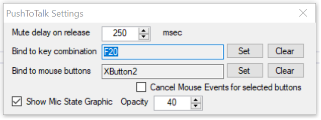

# PushToTalk
A utility to mute/unmute the mic via hotkey (works for Teams, Skype, others, etc)

## Instructions

Simply run the program, it'll open a window if you haven't set a hotkey:

You can set a `Key` combination (any set of keys) and/or 
use non-primary mouse buttons (ie, middle, or button 4 or 5).

If you set a single key (like capslock or scroll-lock) it will automatically
cancel the key event, so that the system doesn't think the key was hit. 

Closing the window will minimize it to the tray.

The tray icon will go from red to green when the mic is active.

The settings are stored in the registry in HKCU/Software/FearTheCowboy/PushToTalk

